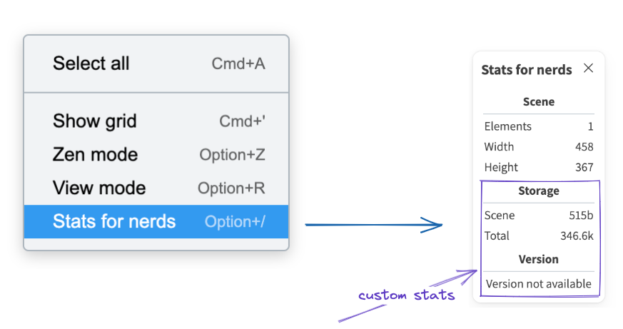

# Render Props

## renderTopRightUI

```
  (isMobile: boolean, appState:{" "}
  
  ) => JSX | null
```

A function returning `JSX` to render `custom` UI in the top right corner of the app.

```jsx
function App() {
  return (
    <div style={{ height: "500px" }}>
      <Excalidraw
        renderTopRightUI={() => {
          return (
            <button
              style={{
                background: "#70b1ec",
                border: "none",
                color: "#fff",
                width: "max-content",
                fontWeight: "bold",
              }}
              onClick={() => window.alert("This is dummy top right UI")}
            >
              {" "}
              Click me{" "}
            </button>
          );
        }}
      />
    </div>
  );
}
```

## renderCustomStats

A function that can be used to render custom stats (returns JSX) in the `nerd stats` dialog.



For example you can use this prop to render the size of the elements in the storage as do in [excalidraw.com](https://excalidraw.com).

```jsx
function App() {
  return (
    <div style={{ height: "500px" }}>
      <Excalidraw
        renderCustomStats={() => (
          <p style={{ color: "#70b1ec", fontWeight: "bold" }}>
            {" "}
            Dummy stats will be shown here{" "}
          </p>
        )}
      />
    </div>
  );
}
```

## renderSidebar

```tsx
() => JSX | null;
```

You can render `custom sidebar` using this prop. This sidebar is the same that the library menu sidebar is using, and can be used for any purposes your app needs.

You need to import the `Sidebar` component from `excalidraw` package and pass your content as its `children`. The function `renderSidebar` should return the `Sidebar` instance.

### Sidebar

The `<Sidebar>` component takes these props (all are optional except `children`):

| Prop       | Type              | Description                                                                                                                                                                                                                                                                                                                                                                                                                     |
| ---------- | ----------------- | ------------------------------------------------------------------------------------------------------------------------------------------------------------------------------------------------------------------------------------------------------------------------------------------------------------------------------------------------------------------------------------------------------------------------------- |
| `children` | `React.ReactNode` | Content you want to render inside the `sidebar`.                                                                                                                                                                                                                                                                                                                                                                                |
| `onClose`  | `function`        | Invoked when the component is closed (by user, or the editor). No need to act on this event, as the editor manages the sidebar open state on its own.                                                                                                                                                                                                                                                                           |
| `onDock`   | `function`        | Invoked when the user toggles the `dock` button. The callback recieves a `boolean` parameter `isDocked` which indicates whether the sidebar is `docked`                                                                                                                                                                                                                                                                         |
| `docked`   | `boolean`         | Indicates whether the sidebar is`docked`. By default, the sidebar is `undocked`. If passed, the docking becomes controlled, and you are responsible for updating the `docked` state by listening on `onDock` callback. To decide the breakpoint for docking you can use [UIOptions.dockedSidebarBreakpoint](../../../../../docs/@excalidraw/excalidraw/api/props/ui-options/#dockedsidebarbreakpoint) for more info on docking. |
| `dockable` | `boolean`         | Indicates whether to show the `dock` button so that user can `dock` the sidebar. If `false`, you can still dock programmatically by passing `docked` as `true`.                                                                                                                                                                                                                                                                 |

The sidebar will always include a header with `close / dock` buttons (when applicable). You can also add custom content to the header, by rendering `<Sidebar.Header>` as a child of the `<Sidebar>` component. Note that the custom header will still include the default buttons.

### Sidebar.Header

| name     | type              | description                                                                                    |
| -------- | ----------------- | ---------------------------------------------------------------------------------------------- |
| children | `React.ReactNode` | Content you want to render inside the sidebar header as a sibling of `close` / `dock` buttons. |

To control the visibility of the sidebar you can use [`toggleMenu("customSidebar")`](../../../../../docs/@excalidraw/excalidraw/api/props/ref/#togglemenu) api available via `ref`.

```tsx
function App() {
  const [excalidrawAPI, setExcalidrawAPI] = useState(null);

  return (
    <div style={{ height: "500px" }}>
      <button className="custom-button" onClick={() => excalidrawAPI.toggleMenu("customSidebar")}>
        {" "}
        Toggle Custom Sidebar{" "}
      </button>
      <Excalidraw
        UIOptions={{ dockedSidebarBreakpoint: 100 }}
        ref={(api) => setExcalidrawAPI(api)}
        renderSidebar={() => {
          return (
            <Sidebar dockable={true}>
              <Sidebar.Header>Custom Sidebar Header </Sidebar.Header>
              <p style={{ padding: "1rem" }}> custom Sidebar Content </p>
            </Sidebar>
          );
        }}
      />
    </div>
  );
}
```
